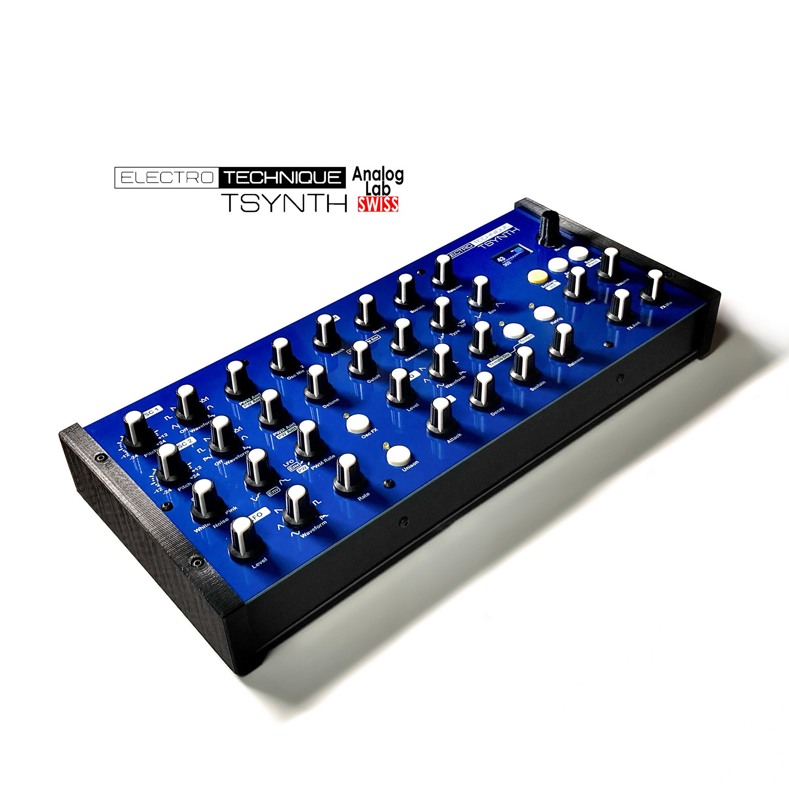
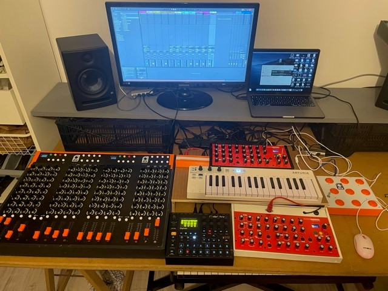
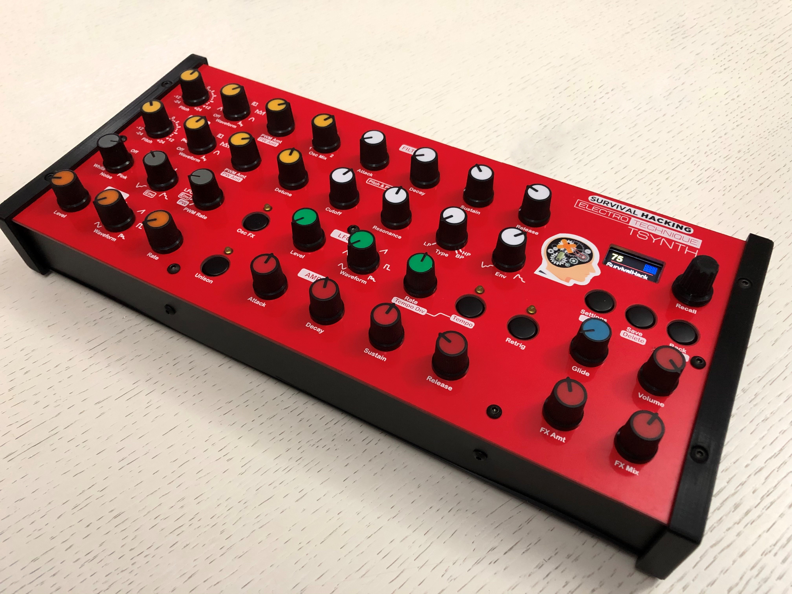
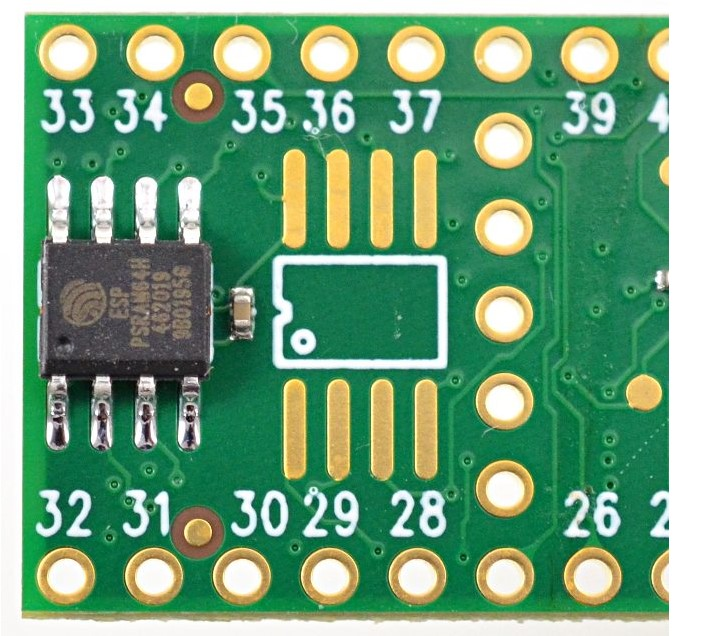
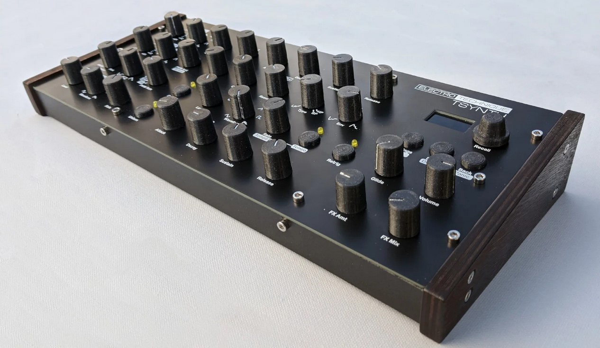
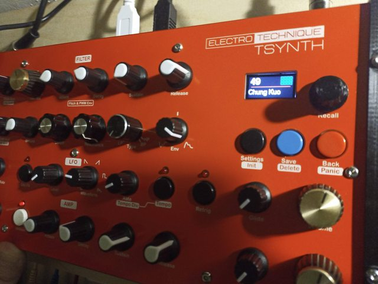
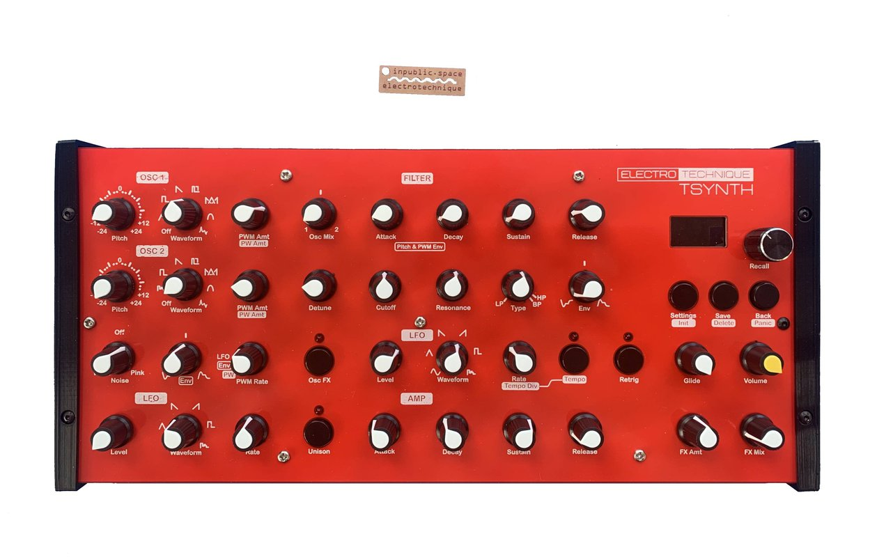
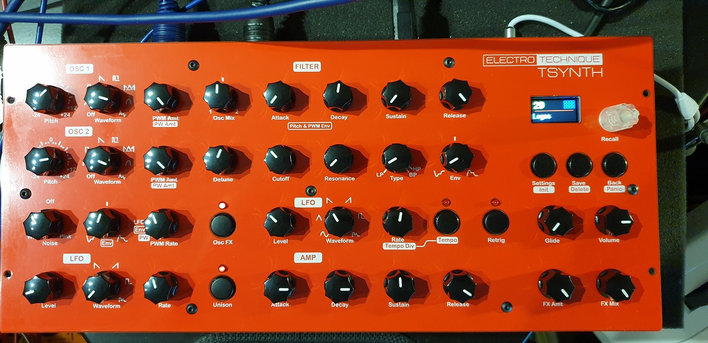
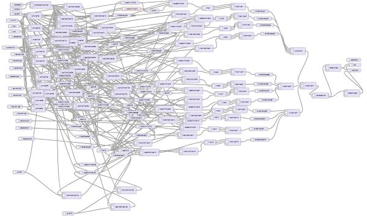

#  Latest News
**29th March 2022** - Firmware V2.33 released - Oscilloscope and memory improvements, exp amp and filter shape defaults.

**14th February 2022** - Lurking around Youtube again, [I saw this](https://www.youtube.com/watch?v=zcAdx4nFmlk). There are a few custom TSynths around now, including one in its own keyboard.

**5th January 2022** - Updated firmware V2.32. Fix PW amount for Osc 2 not updated from patch. 

**11th August 2021** - [Sparkfun electronics](https://www.sparkfun.com/micromod) released the MicroMod version of Teensy last month. It's essentially a Teensy 4 on a small M.2 style board. The idea is that you can swap MicroMod processor boards with various carrier boards - in theory. I was interested in seeing whether a new TSynth main PCB using a Teensy MicroMod would be possible, with an audio DAC board - probably a PCM5102A. This is easier to build without having to mount the T4.1 and Audio Board, then soldering the USB client pads, which some people have had problems with. What do you think? A V1.4 with a Teensy MicroMod? The micro SD card would be on the main PCB near the edge to make it accessible from outside.

**2nd July 2021** - [Firmware V2.31](https://github.com/ElectroTechnique/TSynth-Teensy4.1/tree/master/Firmware) fixes crash in unison mode with monophonic option.

**20th June 2021** - [Firmware V2.30](https://github.com/ElectroTechnique/TSynth-Teensy4.1/tree/master/Firmware) features Vince's exponential Glide option - accessible via the Settings Menu. This mimics analogue synth behaviour where the convergence to the note pitch slows at the end, like a capacitor charge/discharge. Also the source code features the refactoring carried out by Will. Apart from the better design practice that experienced developers will recognise, it has made a major improvement to the handling of memory. Global variable usage has dropped and the AudioMemory setting (memory for audio objects) has dropped from 97 to 60.

Some exciting live atmospherics from [m_1_k_a_c_h_u](https://www.instagram.com/p/CQVH9QgHF9x/) on Instagram.

**4th June 2021** - [Firmware V2.21](https://github.com/ElectroTechnique/TSynth-Teensy4.1/tree/master/Firmware) is released, which has an improved resonance range that will go down to 0.71 - the actual minimum for a 12dB filter. Previously there was noise, which has been cured.

**17th May 2021** Germany reseller [Coq au Lo-res](https://www.coqaulores.de/) are offering discounts on TSynth items including the kit, with the following code **05TSynthophoria21** until the end of the month.

**11th May 2021** A significant update to the firmware for Teensy 4.1 based V1.2 & 1.3 PCBs. [V2.20](https://github.com/ElectroTechnique/TSynth-Teensy4.1/releases/tag/V2.20) has monophonic modes added to the Settings menu. These work on a patch basis and are useful if you want a monophonic playing response. There is a choice of first, last, highest and lowest note priorities. Also both filter and amplifier envelopes have an exponential instead of linear response. The Settings menu has an adjustment value for the Attack response of both, but the most noticable change is that the release stage is smooth and doesn't end so abruptly. This is a global setting. See the updated User Guide for details on this. Also, the code has been considerably refactored for better design and expandability. I'm sure if you want to make your own changes or see how it works, you'll appreciate this. I have Will and Vince to thank for this work. This is why it's open source.

**6th May 2021** Some other fabulous Teensy 4 based synths out there, that really demonstrate the power of the MCU and what you can do with time and talent:

- [Wavetable prototype](https://www.youtube.com/watch?v=B_KyNA13FWU)  
- [M8 Tracker available to buy](https://dirtywave.com/)
- [16-voice polyphonic synth using Teensy 4.0](https://www.youtube.com/watch?v=bujFKE4tqe4)
- [Part of a series](https://www.youtube.com/watch?v=Mdk-aUEtNno)

**3rd May 2021** I think it's almost a year since the first TSynths were offered for sale for Teensy 3.6. Some more development work with the current version is underway. The T4.1 is very capable. A more knoweledgable and experienced programmer is working at the moment and the code has been refactored to be easier to extend and scale. Another really nice [Youtube demo here](https://www.youtube.com/watch?v=_jDlkQcBM0Y), [here](https://www.youtube.com/watch?v=lOP6-ZvF-0o), errr.. [here](https://www.youtube.com/watch?v=8wTKX7kb9w8) and [here!](https://www.youtube.com/watch?v=uN7DcKlAI2k)

**13th April 2021** - It's taken a little while but finally there are now better programmers looking at the code and making changes and pull requests. I'll start adding people as _collaborators_, which gives them permissions to change the code and merge pull requests.

I've also had requests for the KiCAD PCB files. The code is open source and the schematic is available, along with files to make the enclosure etc. The KiCad PCB files for the front panel are also available to resellers and anyone who asks. The reason for this is that JLCPCB can't be trusted not to scratch them! So I no longer waste time and money ordering front panels for resellers and then dealing with JLCPCB customer "service". I may release the main PCB files sometime in the future. In the meantime if you want to make your own PCBs and sell them, then it's your business. The only request I have is that it's clear they originated from you and not ElectroTechnique.

**11th April 2021** - Firmware V2.14 for Teensy4.1 (PCB Revs 1.2/1.3) and V1.29 for Teensy3.6 (PCB Rev 1.1) has been released. This is a significant release as it improves the sound of TSynth. Stereo chorus had discontinuities causing noise, which was particularly noticeable with high pitched sounds. Vince Pearson has worked to greatly reduce this and the stereo chorus is much better now.

**6th April 2021** - Firmware V2.11 fixes some minor parameter save and recall bugs and the stereo chorus has a slightly richer sound by adding two more taps. Teensyduino 1.54 beta versions have a problem with audio (interuptions every few seconds).

**8th March 2021** - DIY synth reseller Analog Lab Swiss [Analog Lab Swiss](https://www.etsy.com/shop/AnalogLabSwiss) has created a [website where patches for synths including TSynth](https://synthpatch.ch/) can be shared.

**5th March 2021** - Another nice TSynth demo on [Youtube from Paul Rau.](https://www.youtube.com/watch?v=dSeR_WddPIQ) Yes, I just lurk around the internet searching for my own synth.

**25th Febuary 2021** - A [Facebook Group](https://www.facebook.com/groups/418750379310464) has been set up by a user for Tsynth builders.

**18th Febuary 2021** - Survival Hacking's Davide Gatti has the fourth installment of his [TSynth build up on Youtube](https://www.youtube.com/watch?v=EhLHQo1h25U). He is showing how to convert a V1.2 PCB to a V1.3.

**17th Febuary 2021** - [Analog Lab Swiss](https://www.etsy.com/fr/shop/AnalogLabSwiss) are now selling kits and fully built TSynths. Very nice choice of blue, black and white colour scheme!

**4th Febuary 2021** - A number of people who bought IPS displays, possibly from kits supplied by resellers, are finding problems due to the screen module being slightly diffirent. The code needs adjusting, [please see this note.](https://github.com/ElectroTechnique/electrotechnique.github.io/discussions/4)

**18th January 2021** - I've been asked by a number of people if there's a discussion forum, so I've created one on the [Github pages here.](https://github.com/ElectroTechnique/electrotechnique.github.io/discussions)

**13th January 2021** - Survival Hacking's Davide Gatti has the third installment of his [TSynth build up on Youtube](https://www.youtube.com/watch?v=2jk79WchWcQ). He tests TSynth's capabilities in some depth, which makes me nervous to watch. But yeah, it sounds great!

**12th January 2020** - Code and firmware V2.10 is now released for V1.3 PCB support.
See this [page for guidance](V1_2ToV1_3.md) on how to modify your V1.2 PCB to work as a V1.3. The firmware will always work on unmodified V1.2 PCBs, however.

**11th January 2020** - The next revision of the PCB - V1.3 is ready and has been tested. 
The changes are:
- The 6N138 optocoupler is now a 6N137. JLCPCB ran out of the previous (half of them went on TSynths) and they have plenty of 6N137s.
- MIDI thru is now a software thru/out with filtering options. V1.2 PCBs can use this if they are simply modified by cutting a trace and soldering a wire.
- The display SCK line has been re-routed with a series 100ohm resistor to get rid of noise coming through the analogue audio at high volumes.
- The display backlight is connected to pin 6 of the T4.1, so it could be turned off or PWM dimmed. This is in anticipation of a possible soft on/off switch or power saving mode, which requires the display backlight to turn off. Again, V1.2 PCBs can easily be modified by users, for this.

There are no changes to the front panel (still V1.1) and controls, connectors, screws etc are in the same places. The code, firmware and updated build guide and user manuals will be available in the next few days.

**10th January 2020** - Two TSynths from an early customer!

**8th January 2020** - Having more than one TSynth may be a luxury(!) at the moment, but I've found that if you want to play and record more than one at a time in a DAW such as Ableton Live, you can use [ASIO4All](http://www.asio4all.org/). Install ASIO4All and in your DAW, select it as the audio device. Then in the ASIO4All control panel, you can select multiple input and output sources - such as more than one TSynth plus your other sound cards/interfaces. You can send MIDI to TSynth via USB and receive digital audio back. So, TSynth only requires the power/client USB cable and nothing else. There will be latency that you'll need to adjust for in your DAW, but it's a neat way to play multiple TSynths and record stereo digital audio without expensive audio interfaces and analogue audio cables.

**6th January 2021** - Survival Hacking's Davide Gatti has the next installment of his [TSynth build up](https://www.youtube.com/watch?v=MusKKTRkITU) on Youtube. He completes the case and solves a problem with the colour inversion of the display. Some of the displays available have slightly different screens even though they look the same. The colour inversion can be solved *probably* by changing `tft.invertDisplay(true);` to `tft.invertDisplay(false);` in `ST7735Display.h`. But as long as it's a 80x160 SPI display, you will get some help to get it working properly.

**31st December 2020** - Rather a nice professional TSynth assembly video from [Davide Gatti - Survival Hacking](https://www.youtube.com/watch?v=46bIzyM_a88). It's in Italian and my Italian is as good as my Korean, which is 끔찍한. It must have come from a reseller, as I still cannot ship from Korea to Italy at a reasonable cost. It's in parts and at the end of part one, he's assembled it but not switched it on, so we'll have to wait until part two to see if it catches fire or plays nice sounds!

**24th December 2020** - TSynth is one of [Tindie's sound products of the year](https://blog.tindie.com/2020/12/tindie-sound-gear-of-the-year-awards-2020/). The main PCB is being revised to add a soft/hard MIDI out/thru option, elimination of all noise from the analogue output and a connection to the display backlight in a future plan to add a possible soft on-off switch. The 6N138 optocoupler has been exchanged to a 6N137. Nothing else has changed and future firmware will still work with the current V1.2 PCB.

**23rd December 2020** - Video round-up

- [TSynth playing chords in this experimental set](https://www.youtube.com/watch?v=yMwQADX_V1o)
- [TSynth 4.1 demonstrating presets from Antonio](https://www.youtube.com/watch?v=z2674LdYW5I)
- [TSynth 3.6 played with stylophone! Has a larger display too.](https://www.youtube.com/watch?v=2ZOaFciLC5Y)

**12th December 2020** - A UK only, special on Tindie today! You need cheering up!

**5th December 2020** - A nice video showing the building of a [TSynth from Antonio](https://www.youtube.com/watch?v=OZFJm-TWLQ4)

**4th December 2020** - The noise on the analogue audio output when the volume is high, caused by the nearby SCK line of the display can be diminished greatly by putting a 100ohm resistor in series. If you want to make a modification, you need to break the track on the bottom side of the board that connects the T4.1 to the SCK pin of the display. Use a scalpel to remove some of the solder mask and solder the resistor in place. An SMD resistor would be best, but a through-hole one will work.

**1st December 2020** -Investigating the noise on the analogue output when volume is high has revealed that it's coming from the SPI clock line on the nearby display. A work-around that dimishes it greatly is to lower the clockspeed by setting #define ST7735_SPICLOCK in ST7735_t3.h to 8000000, although this lowers the display refresh times. If the noise is bothering you, [V2.03 of the firmware with the SPI clock speed lowered is here.](https://1drv.ms/u/s!Avbtf5PcDsB0i5NMmffwhAOq22VSzQ?e=OUQtdf)

**30th November 2020** - Firmware V2.03 fixes silly problem introduced to reinialise routine when QUANTISE_FACTOR and ADC reads were altered to give better performance. 

I've also found the cause of the whirring noise that bleeds into the analogue output when the volume is raised. It's the display being updated by the displayThread(), probably digital noise from the SPI? I'll investigate.

**19th November 2020** - I've soldered an 8MB PSRAM chip on a T4.1 and am experimenting to see if there is a performance improvement and the possibility of stable 16 voice polyphony. I had to go to 12 note because I suspected the T4.1 was failing to allocate enough RAM. Adding EXTMEM to the objects in the AudioPatching.h places them in the memory chip and the reported variable usage on compiling, is decreasing. So we'll see.

**18th November 2020** - _I'm on ur social nets, lurkin!_ As the cool kids used to say. Some interesting finished TSynths out there.

**15th November 2020** - Firmware V2.02 - Volume control reverted back to controlling only headphone volume (noise from MCU was continuously in background at all volume levels from headphone output). USB digital and line out are at fixed volumes. Fix to code that sets the volume level due to velocity that made unison voices too loud. Some improvement to oscilloscope display -needs more work.

**6th November 2020** - More finished TSynths and some positive comments about its sound.

**5th November 2020** - There are now over 200 TSynth PCBs around the world. Most of those are now with resellers. A few have been made into finished units and can be seen around the internet. I'm waiting for some good demos to be uploaded showing what it is capable of.

**8th October 2020** - More stock is coming and will be available next week. Still not enough but I will have some resellers offering kits, that I'll link to soon.

**28th September 2020** - 19 sets of PCBs and front panels have sold on Tindie in 15 minutes. The waiting list is entirely emailed when stock goes on, which isn't ideal for people waiting since May. I'm endeavouring to get fortnightly orders from JLCPCB and hopefully everyone will have what they want within a couple of months. This isn't supposed to be a boutique synth, whatever that is. Korea Customs will take an interest in imports over $150 and I cannot run this full-time.

**23rd September 2020** -  T3.6 & T4.1 - Volume affects both digital and analogue audio. T3.6 firmware now at V1.27.

**17th September 2020** -  T3.6 version firmware now at V1.26 with improved ADC reading that decreases noise and increases the sensitivity of pot reads. AudioMemory is increased to 48. Filter cutoff now has 256 values, making low frequency sweeps smoother.

**15th September 2020** -  Cross modulation! OscFX has another mode (like unison) that you access by holding for 1 second. Cross modulation FM modulates one oscillator with the other, and in the case of TSynth, both modulate each other. By adjusting Osc Mix, this makes one or the other or both oscillators sound with cross mod from the other.

**14th September 2020** - Filter frequency cutoff is now 8 bit, 256 values instead of 127, for smoother changes particularly at low frequencies. This will probably be included in the T3.6 firmware.

JLCPCB have finished the boards, which will arrive within a week and then we start selling again on Tindie. I'm still looking for a courier here in South Korea to bypass using the post office, DHL may be possible if not too expensive.

**10th September 2020** - I am 'finessing' the filter cutoff response as I wait for the PCBs to arrive from JLCPCB. The idea is the alter the cutoff width to allow deep bass at low cutoff and sharper response higher up. I think it sounds about right now. This adds 'character', of course. I'll add this to the T3.6 firmware which is at 1.24 now.

**6th September 2020** - Firmware 1.23 for the current Teesny 3.6 version of TSynth is released. This adds support for MIDI CC from the panel controls to be transmitted over USB Host and Client MIDI ports, which is useful when recording control changes while sequencing. Also a VU Meter that shows amplitude of the audio signal - not a true VU meter. This is the last update and any further firmware will be bug fixes only. Much of the features developed in the new TSynth are now in current TSynth.

**1st September 2020** - And today we have a linear VU meter on the display.

**30th August 2020** - Firmware V1.22 fixes a further problem with glide with held notes. The new TSynth for Teensy 4.1 is nearing readiness. It has another unison mode, accessed by holding the unison button for one second. This is chord unison, which plays one note chords, which are selectable from the detune control.

**26th August 2020** - Firmware V1.21 fixes a problem with glide not gliding from the previous note properly.

**22nd August 2020** - A new feature that appears on among other synths, the Korg 'logue series is an oscilloscope display. This is an 'experimental feature', meaning that it works but not quite as you might hope for. More work is needed, but it can be turned on and off in the Settings menu.

**21st August 2020** - 'Pick-up' (see previous post) is now working well enough to include on the current T3.6 version of TSynth - see firmware page for new V1.19. Also added 'Bass Enhance' that uses the SGTL5000 audio codec chip to enhance bass frequencies. Both of these are options in the Settings menu.

**20th August 2020** - T4.1 version - When you alter parameter settings from either the front panel or via MIDI, the value will jump from what it is set in the patch, to what the current value of the control is. This will sound abrupt and is how all early polysynths worked (Prophet 5, Jupiter 8...) 'Pick-up' is a new experimental setting, that only changes the value when the front panel control or the MIDI control is near the current value. It picks-up the value and then alters it to prevent jumps in the sound. This is working well via MIDI but needs some improvement when using the front panel controls - it works when you change the value slowly and steadily. Not all controls will use pick-up. Filter cutoff, resonance and LFO rate and amount are the obvious things you might change during performance. Other controls like waveform type and the envelopes don't really need it.

**18th August 2020** - Firmware V1.17 has been released, which adds velocity sensitivity. This is set in Settings and can be stored for each patch. Default is off. See post below for the four velocity curves.

**16th August 2020** - TSynth will transmit the assigned MIDI CC values for the panel controls via the client USB port. This is useful if you're sequencing using TSynth and want to record parameter changes to the sequencer, however, the values will jump if not the same value as programmed into the patch. I'm working on a 'pick-up' setting to only change the parameter when the control knobs hits the stored patch value.

**13th August 2020** - Nearing the stage where TSynth for Teensy 4.1 is ready. Velocity is now supported, with four different curves as an option in settings as well as off. The patches will store this. 

**10th August 2020** - The next TSynth will have a new Unison voice mode. It will assign voices depending on the number of notes held. 12 notes will use all 12, two notes will use 6+6, three will use 4+4+4 and four will use 3+3+3+3. The detuning is properly set up to support this as well. There is also a 'Bass Enhance' setting in the menu that increases the bass level. This is processed by the SGTL5000 codec IC on the Audio Board and not the Teensy.

**7th August 2020** - Current TSynth - Firmware is now updated to V1.15, with a minor change to when the first patch is loaded after the controls are initially read. Also the source code has been updated so that the Modified Libraries folder is no longer needed, just install the latest version of Teensyduino without making alterations to the Audio folder.

Teensy 4.1 version - Some good news and some not-so-good news. Ok, well the good news is that the firmware is quite stable now, the not-so-good news is that it meant going from 16 note polyphony down to 12. The T4.1 was running out of memory (RAM) when control changes were being made and it was trying to allocate more, which it couldn't always do in time, leading to crashing. Really this isn't a big deal, there's little difference in 24 or 32 oscillators all sounding at once and 12 notes in itself is a big deal for such a low cost synth, particularly with the long list of capabilities and much improved sound. With some optimisation and restructuring of the code 16 notes may be reliably possibly. Hopefully next month the new version will start selling on Tindie. I'm also looking for other outlets to start selling in higher quantities, particularly in the US and Europe.

**5th August 2020** - Firmware is now updated to V1.14. There were problems with firmware compiled with overclocking (240MHz), so all firmware will be compiled with defaults (180MHz). Improvements were made to the way controls were read, pulse waveforms are limited so that they will not become silent when very narrow.

**1st August 2020** - Another early buyer has finished building TSynth and says it sounds great. The problems with the next version with T4.1 have been solved - it needs some memory optimisations, as it's running close to filling the available RAM.

**28th July 2020** - Whoa! 16 note polyphony, 32 oscillators! Unison basses will take your head off! The Teensy 4.1 prototype PCB has no problems. The firmware does however and I'm ploughing through them gradually.

**23rd July 2020** - Great news. After my occasional reminders on the PJRC forum (the maker of Teensy) that the Audio Library would benefit from band-limited waveforms (no unpleasant aliasing of waves due to 'sharp corners'), MarkT has added band-limited square and sawtooth waves. This is a great benefit to all users of the Audio Library and will hopefully appear in the next release of Teensyduino. The T4.1 version of TSynth will use these. The T3.6 version currently uses wavetables to band-limit square and sawtooth, and will continue to do so because the extra computation is too much for a T3.6 with 12 oscillators. This has also solved the odd problem of lock-ups when using wavetable sawtooths on T4.1 mentioned last time. Now waiting for the T4.1 prototype from JLCPCB to arrive within the next couple of days. I still cannot ship PCB sets in the quantites needed to satisfy the few hundred waiting on Tindie - sorry.

**10th July 2020** - Nearly ready to get a PCB prototype for Teensy 4.1. It is possible to put a T4.1 on the current T3.6 boards - see picture below. Currently however, the firmware needs changing to slow down the multiplexer reading, plus there are odd problems with lock-ups when a patch using the 'band-limited' sawtooth wave is selected - but only with 16 voice polyphony... Memory problem? Plus some noise on USB audio. Having 48 Du Pont wires probably isn't ideal for fast digital and analogue signals, so we'll see how the PCB fares. The new PCB will have an option for a MIDI thru DIN socket fed directly from MIDI In (the SMD buffer ic needed will be on the board already) and a footprint for a 1/4" socket in the same place as the current 3.5mm socket. The PCB will cost the same. 

**8th July 2020** - I put some more stock on Tindie and it started selling quickly as everyone on the 500+ waiting list gets an email and then it's a scramble. Sorry about this. More stock will follow next week. I'm also limited by how many PCBs I can order, pack and handle at the post office too. Ideally, things would go into a box, label printed and a parcel service would collect it. The reality is that I'm doing this in my spare time and dealing in a foreign country. Shipping is still limited, if your country is not on the list on [Tindie](https://www.tindie.com/products/electrotechnique/tsynth-teensy-based-diy-programmable-poly-synth/), then I cannot ship.

**22nd June 2020** - Ten more sets of (T3.6 based) boards will arrive from the manufacturer JLCPCB next week. There is over 500 people on the Tindie waiting list who will receive emails when it's back in stock, so I'm expecting them to go within a couple of hours.
Development of T4.1 is still on-going. I have 16 note polyphony at a max of 40% CPU, but some odd problem with certain waveforms. The PCB isn't sorted yet and a prototype needs to be tested. A T4.1 will work on a T3.6 board if an adaptor could be made.

**17th June 2020** - Another TSynth has been successfully built by an early buyer. Also some nice reviews on Tindie.

**14th June 2020** - The version supporting Teensy 4.1 is well under way.

**13th June 2020** - The first TSynth has been built by an early buyer.

**10th June 2020** - Teensy 4.1 has arrived and the first thing to notice is the expected lower CPU load and also much better note on response. 

**20th May 2020** - The first few PCB sets have sold out on Tindie. I'm working on changing the main PCB for Teensy 4.1, which has just been released. In the short term, this will offer more polyphony (16 is probably enough!) and quicker note on response. I also want to implement 'pick up' when changing the controls, which starts to change the value when the control matches the current patch value (this prevents jumps when adjusting the control.) Also I've been asked to consider including MIDI Thru, which is easy to add and another option.

Really, I'm also waiting for the first buyers to build it and report back. I'm probably going to include the display with the PCBs next time - this will be about $3 extra, just to ensure that you can build it without getting the wrong display and having to make code changes. We'll see what happens, but I've played with TSynth every day for months, it's switched on for several hours at a time and it's stable and sounds great.

**16th May 2020** - Shipping from Korea to various countries is limited at the moment, see the list on the Tindie page.

**14th May 2020** - The PCB and front panels are now available to buy on Tindie.

**7th May 2020** - The production version 1.1 of the PCBs and front panels have arrived and will be ready to buy within a week or two. A demo video will appear within a few days. I'm not so great at those things, but it'll show the range of sounds and capabilities.

**19th April 2020** - The code is now mostly finished with improvements in various areas. Glide is now polyphonic. The schematic and a number of files for making the enclosure have been added. The PCB and front panel designs are finalised.

**6th April 2020** - The main PCB has had a few minor revisons including 0.1uF capacitors across all the potentiometers to reduce noise. I'm considering adding a footprint to allow a 3.5mm jack for TRS MIDI as an option instead of the 5 pin DIN, which would allow the synth to be less high. The code has had some improvements - sawtooth and square waves are now band limited _to some extent_ by using wavetables for sets of notes and loading these as arbitrary waves. The Settings menu allows you to set MIDI channel, pitchbend range, key tracking and mod wheel depth.
