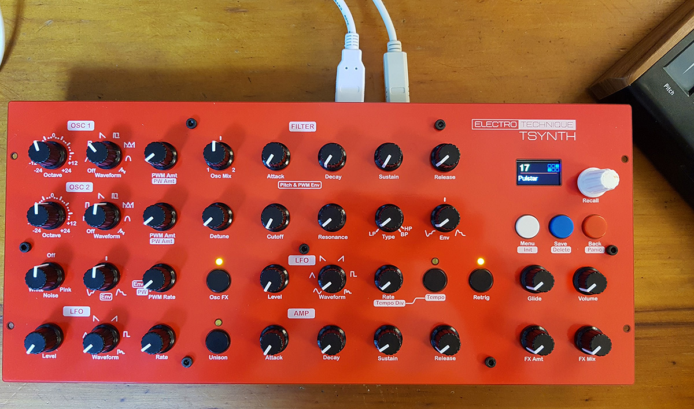
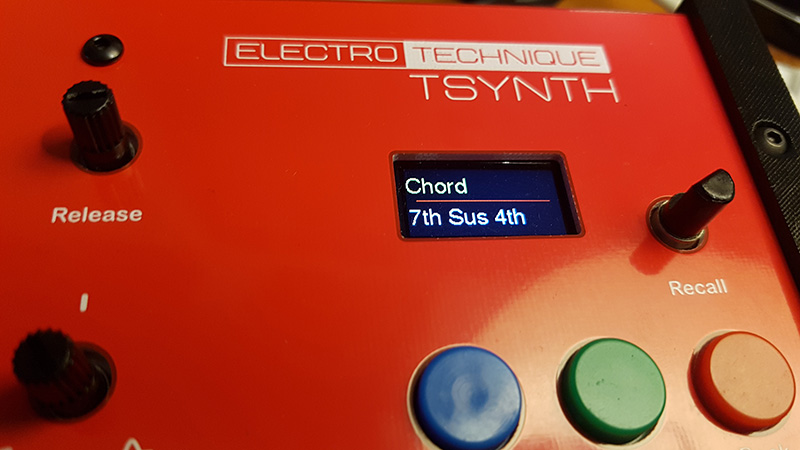
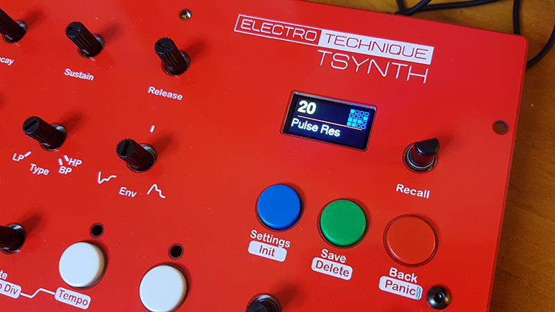
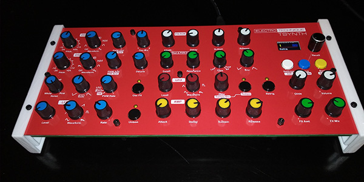

# Teensy 4.1 based synthesizer using PJRC Audio Board and Audio Lib

The pcb and front panel as seen below are available from Tindie.com with SMD 4067 multiplexers, 6N138 opto-isolator, capacitors and resistors fitted. The entire cost of parts to build TSynth will be around $99 if you buy components from the cheaper suppliers and the build time around two hours to solder. Plans for a 3D printed/laser cut enclosure are also available.
Questions: info@electrotechnique.cc

** Go to [Latest News](#news)

PCB and front panel are now available (when there's stock...) from the [Tindie Store](https://www.tindie.com/stores/electrotechnique/)

Github has [source code, model files and documents](https://github.com/ElectroTechnique/)

Build Guide and User Manual for T4.1 (PCB Rev 1.2) are here - [Docs](https://github.com/ElectroTechnique/TSynth-Teensy4.1/tree/master/Documents)

Build Guide and User Manual for T3.6 (PCB Rev 1.1) are here - [Docs](https://github.com/ElectroTechnique/TSynth-for-Teensy3.6/tree/master/Docs)

**Current T4.1 firmware (PCB Rev 1.2) is here - [Firmware](https://github.com/ElectroTechnique/TSynth-Teensy4.1/tree/master/Firmware)**

**Current T3.6 firmware (PCB Rev 1.1) is here - [Firmware](https://github.com/ElectroTechnique/TSynth-for-Teensy3.6/tree/master/Firmware)**

See a [Youtube demo](https://www.youtube.com/watch?v=uCA2L7CeWSE)

# Specifications

Oscillators
- Twelve voice polyphony (last note priority), two oscillators per voice, velocity sensitive, detunable with +/- 2 octaves range, Sine/Sample & Hold (like tuned noise)/Square/Sawtooth/Ramp/PWM/Var Triangle/User waveforms and level. Square, Sawtooth and Pulse waves are band-limited.
- Pulse Width/Var Triangle can be set for each oscillator with PWM by dedicated LFO or from the filter envelope
- Pink or white noise level
- Dedicated LFO for pitch mod (can be retriggered by note on), Sine/Triangle/Sawtooth/Ramp/Square/S&H waveforms
- Pitch can be modulated by filter envelope (+/-)
- Oscillator FX - XOR ‘Ring Mod’ (creates lots of harmonics with certain waveforms) and X Mod 'Cross Modulation' bell-like sounds.
- Dynamic Unison with all 24 oscillators detunable from each other - one, two, three or four notes can be played with oscillators distributed among them
- Chord Unison with all oscillators playing a chord selected from detune control - major, minor, diminshed...
- Polyphonic Glide with variable time

Filter
- State variable 12dB filter (SVF) with continuous mix between LP and HP (provides notch filter) and BP
- Cutoff freq and resonance
- Cutoff can be modulated by dedicated ADSR envelope (+/-), dedicated LFO
- LFO has same waveforms as pitch LFO (can be retriggered by note on)  and rate can be set to match MIDI clock (tempo) with variable time division (1,3/4,1/2,1/4,1/8...)

Amplifier
- Dedicated ADSR envelope
- Volume for headphone output
- Effect amount and mix  - currently for stereo ensemble chorus rate and mix but could be set up to allow choices in Settings menu

Settings Menu
- Encoder with button for data entry, Back button for menu navigation
- Save and Delete buttons for storing patches, holding Settings initialises the current patch to match the panel controls. Holding the Save button takes you into a patch deletion page.
- Velocity curve, Pitch Bend and Mod Wheel range, VU Meter, Oscilloscope display, Bass enhance, MIDI In and Out channel.
- The Settings menu makes the synth very flexible with future possibilities for changing User waveforms, alternative filters, alternative effects with further parameter settings.

MIDI
- USB HOST MIDI Class Compliant (direct connection to MIDI controller, no PC needed)
- USB Client MIDI In from PC
- MIDI In 5 pin DIN
- MIDI Thru 5 pin DIN

Audio
- SGTL5000 Audio Shield 16 bit, 44.1 kHz  Stereo out
- USB Audio in/out—appears as 16 bit, 44.1 kHz  audio interface on PC

#  Latest News
**28th September 2020** - 19 sets of PCBs and front panels have sold on Tindie in 15 minutes. The waiting list is entirely emailed when stock goes on, which isn't ideal for people waiting since May. I'm endeavouring to get fortnightly orders from JLCPCB and hopefully everyone will have what they want within a couple of months. This isn't supposed to be a boutique synth, whatever that is.

**23rd September 2020** -  T3.6 & T4.1 - Volume affects both digital and analogue audio. T3.6 firmware now at V1.27.

**17th September 2020** -  T3.6 version firmware now at V1.26 with improved ADC reading that decreases noise and increases the sensitivity of pot reads. AudioMemory is increased to 48. Filter cutoff now has 256 values, making low frequency sweeps smoother.

**15th September 2020** -  Cross modulation! OscFX has another mode (like unison) that you access by holding for 1 second. Cross modulation FM modulates one oscillator with the other, and in the case of TSynth, both modulate each other. By adjusting Osc Mix, this makes one or the other or both oscillators sound with cross mod from the other.

**14th September 2020** - Filter frequency cutoff is now 8 bit, 256 values instead of 127, for smoother changes particularly at low frequencies. This will probably be included in the T3.6 firmware.

JLCPCB have finished the boards, which will arrive within a week and then we start selling again on Tindie. I'm still looking for a courier here in South Korea to bypass using the post office, DHL may be possible if not too expensive.

**10th September 2020** - I am 'finessing' the filter cutoff response as I wait for the PCBs to arrive from JLCPCB. The idea is the alter the cutoff width to allow deep bass at low cutoff and sharper response higher up. I think it sounds about right now. This adds 'character', of course. I'll add this to the T3.6 firmware which is at 1.24 now.

**6th September 2020** - Firmware 1.23 for the current Teesny 3.6 version of TSynth is released. This adds support for MIDI CC from the panel controls to be transmitted over USB Host and Client MIDI ports, which is useful when recording control changes while sequencing. Also a VU Meter that shows amplitude of the audio signal - not a true VU meter. This is the last update and any further firmware will be bug fixes only. Much of the features developed in the new TSynth are now in current TSynth.

**1st September 2020** - And today we have a linear VU meter on the display.

**30th August 2020** - Firmware V1.22 fixes a further problem with glide with held notes. The new TSynth for Teensy 4.1 is nearing readiness. It has another unison mode, accessed by holding the unison button for one second. This is chord unison, which plays one note chords, which are selectable from the detune control.

**26th August 2020** - Firmware V1.21 fixes a problem with glide not gliding from the previous note properly.

**22nd August 2020** - A new feature that appears on among other synths, the Korg 'logue series is an oscilloscope display. This is an 'experimental feature', meaning that it works but not quite as you might hope for. More work is needed, but it can be turned on and off in the Settings menu.

**21st August 2020** - 'Pick-up' (see previous post) is now working well enough to include on the current T3.6 version of TSynth - see firmware page for new V1.19. Also added 'Bass Enhance' that uses the SGTL5000 audio codec chip to enhance bass frequencies. Both of these are options in the Settings menu.

**20th August 2020** - T4.1 version - When you alter parameter settings from either the front panel or via MIDI, the value will jump from what it is set in the patch, to what the current value of the control is. This will sound abrupt and is how all early polysynths worked (Prophet 5, Jupiter 8...) 'Pick-up' is a new experimental setting, that only changes the value when the front panel control or the MIDI control is near the current value. It picks-up the value and then alters it to prevent jumps in the sound. This is working well via MIDI but needs some improvement when using the front panel controls - it works when you change the value slowly and steadily. Not all controls will use pick-up. Filter cutoff, resonance and LFO rate and amount are the obvious things you might change during performance. Other controls like waveform type and the envelopes don't really need it.

**18th August 2020** - Firmware V1.17 has been released, which adds velocity sensitivity. This is set in Settings and can be stored for each patch. Default is off. See post below for the four velocity curves.

**16th August 2020** - TSynth will transmit the assigned MIDI CC values for the panel controls via the client USB port. This is useful if you're sequencing using TSynth and want to record parameter changes to the sequencer, however, the values will jump if not the same value as programmed into the patch. I'm working on a 'pick-up' setting to only change the parameter when the control knobs hits the stored patch value.

**13th August 2020** - Nearing the stage where TSynth for Teensy 4.1 is ready. Velocity is now supported, with four different curves as an option in settings as well as off. The patches will store this. 

**10th August 2020** - The next TSynth will have a new Unison voice mode. It will assign voices depending on the number of notes held. 12 notes will use all 12, two notes will use 6+6, three will use 4+4+4 and four will use 3+3+3+3. The detuning is properly set up to support this as well. There is also a 'Bass Enhance' setting in the menu that increases the bass level. This is processed by the SGTL5000 codec IC on the Audio Board and not the Teensy.

**7th August 2020** - Current TSynth - Firmware is now updated to V1.15, with a minor change to when the first patch is loaded after the controls are initially read. Also the source code has been updated so that the Modified Libraries folder is no longer needed, just install the latest version of Teensyduino without making alterations to the Audio folder.

Teensy 4.1 version - Some good news and some not-so-good news. Ok, well the good news is that the firmware is quite stable now, the not-so-good news is that it meant going from 16 note polyphony down to 12. The T4.1 was running out of memory (RAM) when control changes were being made and it was trying to allocate more, which it couldn't always do in time, leading to crashing. Really this isn't a big deal, there's little difference in 24 or 32 oscillators all sounding at once and 12 notes in itself is a big deal for such a low cost synth, particularly with the long list of capabilities and much improved sound. With some optimisation and restructuring of the code 16 notes may be reliably possibly. Hopefully next month the new version will start selling on Tindie. I'm also looking for other outlets to start selling in higher quantities, particularly in the US and Europe.

**5th August 2020** - Firmware is now updated to V1.14. There were problems with firmware compiled with overclocking (240MHz), so all firmware will be compiled with defaults (180MHz). Improvements were made to the way controls were read, pulse waveforms are limited so that they will not become silent when very narrow.

**1st August 2020** - Another early buyer has finished building TSynth and says it sounds great. The problems with the next version with T4.1 have been solved - it needs some memory optimisations, as it's running close to filling the available RAM.

**28th July 2020** - Whoa! 16 note polyphony, 32 oscillators! Unison basses will take your head off! The Teensy 4.1 prototype PCB has no problems. The firmware does however and I'm ploughing through them gradually.

**23rd July 2020** - Great news. After my occasional reminders on the PJRC forum (the maker of Teensy) that the Audio Library would benefit from band-limited waveforms (no unpleasant aliasing of waves due to 'sharp corners'), MarkT has added band-limited square and sawtooth waves. This is a great benefit to all users of the Audio Library and will hopefully appear in the next release of Teensyduino. The T4.1 version of TSynth will use these. The T3.6 version currently uses wavetables to band-limit square and sawtooth, and will continue to do so because the extra computation is too much for a T3.6 with 12 oscillators. This has also solved the odd problem of lock-ups when using wavetable sawtooths on T4.1 mentioned last time. Now waiting for the T4.1 prototype from JLCPCB to arrive within the next couple of days. I still cannot ship PCB sets in the quantites needed to satisfy the few hundred waiting on Tindie - sorry.

**10th July 2020** - Nearly ready to get a PCB prototype for Teensy 4.1. It is possible to put a T4.1 on the current T3.6 boards - see picture below. Currently however, the firmware needs changing to slow down the multiplexer reading, plus there are odd problems with lock-ups when a patch using the 'band-limited' sawtooth wave is selected - but only with 16 voice polyphony... Memory problem? Plus some noise on USB audio. Having 48 Du Pont wires probably isn't ideal for fast digital and analogue signals, so we'll see how the PCB fares. The new PCB will have an option for a MIDI thru DIN socket fed directly from MIDI In (the SMD buffer ic needed will be on the board already) and a footprint for a 1/4" socket in the same place as the current 3.5mm socket. The PCB will cost the same. 

**8th July 2020** - I put some more stock on Tindie and it started selling quickly as everyone on the 500+ waiting list gets an email and then it's a scramble. Sorry about this. More stock will follow next week. I'm also limited by how many PCBs I can order, pack and handle at the post office too. Ideally, things would go into a box, label printed and a parcel service would collect it. The reality is that I'm doing this in my spare time and dealing in a foreign country. Shipping is still limited, if your country is not on the list on [Tindie](https://www.tindie.com/products/electrotechnique/tsynth-teensy-based-diy-programmable-poly-synth/), then I cannot ship.

**22nd June 2020** - Ten more sets of (T3.6 based) boards will arrive from the manufacturer JLCPCB next week. There is over 500 people on the Tindie waiting list who will receive emails when it's back in stock, so I'm expecting them to go within a couple of hours.
Development of T4.1 is still on-going. I have 16 note polyphony at a max of 40% CPU, but some odd problem with certain waveforms. The PCB isn't sorted yet and a prototype needs to be tested. A T4.1 will work on a T3.6 board if an adaptor could be made.

**17th June 2020** - Another TSynth has been successfully built by an early buyer. Also some nice reviews on Tindie.

**14th June 2020** - The version supporting Teensy 4.1 is well under way.

**13th June 2020** - The first TSynth has been built by an early buyer.

**10th June 2020** - Teensy 4.1 has arrived and the first thing to notice is the expected lower CPU load and also much better note on response. 

**20th May 2020** - The first few PCB sets have sold out on Tindie. I'm working on changing the main PCB for Teensy 4.1, which has just been released. In the short term, this will offer more polyphony (16 is probably enough!) and quicker note on response. I also want to implement 'pick up' when changing the controls, which starts to change the value when the control matches the current patch value (this prevents jumps when adjusting the control.) Also I've been asked to consider including MIDI Thru, which is easy to add and another option.

Really, I'm also waiting for the first buyers to build it and report back. I'm probably going to include the display with the PCBs next time - this will be about $3 extra, just to ensure that you can build it without getting the wrong display and having to make code changes. We'll see what happens, but I've played with TSynth every day for months, it's switched on for several hours at a time and it's stable and sounds great.

**16th May 2020** - Shipping from Korea to various countries is limited at the moment, see the list on the Tindie page.

**14th May 2020** - The PCB and front panels are now available to buy on Tindie.

**7th May 2020** - The production version 1.1 of the PCBs and front panels have arrived and will be ready to buy within a week or two. A demo video will appear within a few days. I'm not so great at those things, but it'll show the range of sounds and capabilities.

**19th April 2020** - The code is now mostly finished with improvements in various areas. Glide is now polyphonic. The schematic and a number of files for making the enclosure have been added. The PCB and front panel designs are finalised.

**6th April 2020** - The main PCB has had a few minor revisons including 0.1uF capacitors across all the potentiometers to reduce noise. I'm considering adding a footprint to allow a 3.5mm jack for TRS MIDI as an option instead of the 5 pin DIN, which would allow the synth to be less high. The code has had some improvements - sawtooth and square waves are now band limited _to some extent_ by using wavetables for sets of notes and loading these as arbitrary waves. The Settings menu allows you to set MIDI channel, pitchbend range, key tracking and mod wheel depth.

