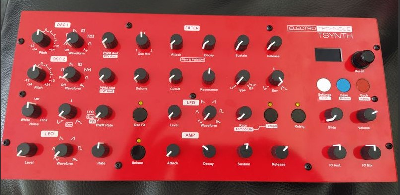
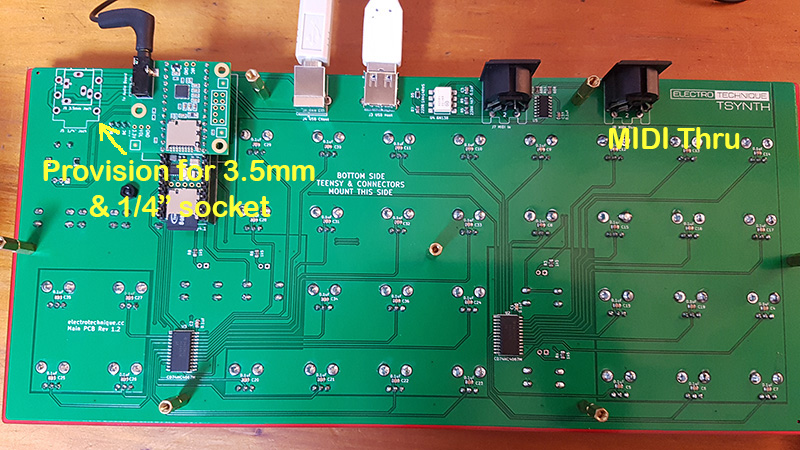
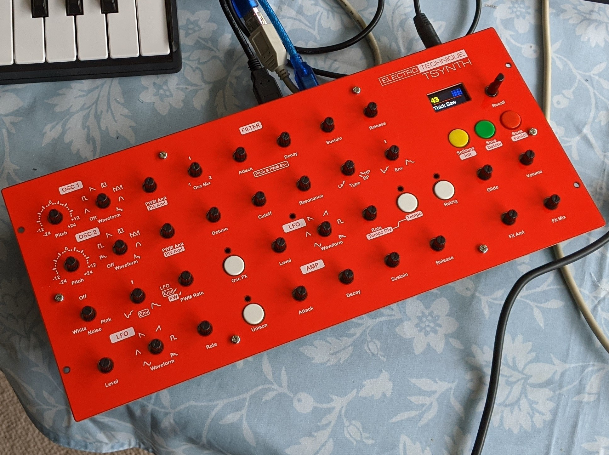

# Teensy 3.6 based synthesizer using PJRC Audio Board and Audio Lib

The pcb and front panel as seen below are available from Tindie.com with SMD 4067 multiplexers, 6N138 opto-isolator, capacitors and resistors fitted. The entire cost of parts to build TSynth will be around $99 if you buy components from the cheaper suppliers and the build time around two hours to solder. Plans for a 3D printed/laser cut enclosure will be available.
Questions: info@electrotechnique.cc

PCB and front panel are now available (when there's stock...) from the [Tindie Store](https://www.tindie.com/stores/electrotechnique/)

Github has [source code, model files and documents](https://github.com/ElectroTechnique/TSynth)

Build Guide and User Manual are here - [Docs](https://github.com/ElectroTechnique/TSynth/tree/master/Docs)

Current firmware is here - [Firmware](https://github.com/ElectroTechnique/TSynth/tree/master/Firmware)

See a [Youtube demo](https://youtu.be/ymccocF6hTs)

# Latest News
**18th August 2020** - Firmware V1.17 has been released, which adds velocity sensitivity. This set in Settings and can be stored for each patch. Default is off. See post below for the four velocity curves.

**16th August 2020** - TSynth will transmit the assigned MIDI CC values for the panel controls via the client USB port. This is useful if your sequencing using TSynth and want to record parameter changes to the sequencer, however, the values will jump if not the same value as programmed into the patch. I'm working on a 'pick-up' setting to only change the parameter when the control knobs hits the stored patch value.

**13th August 2020** - Nearing the stage where TSynth for Teensy 4.1 is ready. Velocity is now supported, with four different curves as an option in settings as well as off. The patches will store this. 

**10th August 2020** - The next TSynth will have a new Unison voice mode. It will assign voices depending on the number of notes held. 12 notes will use all 12, two notes will use 6+6, three will use 4+4+4 and four will use 3+3+3+3. The detuning is properly set up to support this as well. There is also a 'Bass Enhance' setting in the menu that increases the bass level. This is processed by the SGTL5000 codec IC on the Audio Board and not the Teensy.

**7th August 2020** - Current TSynth - Firmware is now updated to V1.15, with a minor change to when the first patch is loaded after the controls are initially read. Also the source code has been updated so that the Modified Libraries folder is no longer needed, just install the latest version of Teensyduino without making alterations to the Audio folder.

Teensy 4.1 version - Some good news and some not-so-good news. Ok, well the good news is that the firmware is quite stable now, the not-so-good news is that it meant going from 16 note polyphony down to 12. The T4.1 was running out of memory (RAM) when control changes were being made and it was trying to allocate more, which it couldn't always do in time, leading to crashing. Really this isn't a big deal, there's little difference in 24 or 32 oscillators all sounding at once and 12 notes in itself is a big deal for such a low cost synth, particularly with the long list of capabilities and much improved sound. With some optimisation and restructuring of the code 16 notes may be reliably possibly. Hopefully next month the new version will start selling on Tindie. I'm also looking for other outlets to start selling in higher quantities, particularly in the US and Europe.

**5th August 2020** - Firmware is now updated to V1.14. There were problems with firmware compiled with overclocking (240MHz), so all firmware will be compiled with defaults (180MHz). Improvements were made to the way controls were read, pulse waveforms are limited so that they will not become silent when very narrow.

**1st August 2020** - Another early buyer has finished building TSynth and says it sounds great. The problems with the next version with T4.1 have been solved - it needs some memory optimisations, as it's running close to filling the available RAM.

**28th July 2020** - Whoa! 16 note polyphony, 32 oscillators! Unison basses will take your head off! The Teensy 4.1 prototype PCB has no problems. The firmware does however and I'm ploughing through them gradually.

**23rd July 2020** - Great news. After my occasional reminders on the PJRC forum (the maker of Teensy) that the Audio Library would benefit from band-limited waveforms (no unpleasant aliasing of waves due to 'sharp corners'), MarkT has added band-limited square and sawtooth waves. This is a great benefit to all users of the Audio Library and will hopefully appear in the next release of Teensyduino. The T4.1 version of TSynth will use these. The T3.6 version currently uses wavetables to band-limit square and sawtooth, and will continue to do so because the extra computation is too much for a T3.6 with 12 oscillators. This has also solved the odd problem of lock-ups when using wavetable sawtooths on T4.1 mentioned last time. Now waiting for the T4.1 prototype from JLCPCB to arrive within the next couple of days. I still cannot ship PCB sets in the quantites needed to satisfy the few hundred waiting on Tindie - sorry.

**10th July 2020** - Nearly ready to get a PCB prototype for Teensy 4.1. It is possible to put a T4.1 on the current T3.6 boards - see picture below. Currently however, the firmware needs changing to slow down the multiplexer reading, plus there are odd problems with lock-ups when a patch using the 'band-limited' sawtooth wave is selected - but only with 16 voice polyphony... Memory problem? Plus some noise on USB audio. Having 48 Du Pont wires probably isn't ideal for fast digital and analogue signals, so we'll see how the PCB fares. The new PCB will have an option for a MIDI thru DIN socket fed directly from MIDI In (the SMD buffer ic needed will be on the board already) and a footprint for a 1/4" socket in the same place as the current 3.5mm socket. The PCB will cost the same. 

**8th July 2020** - I put some more stock on Tindie and it started selling quickly as everyone on the 500+ waiting list gets an email and then it's a scramble. Sorry about this. More stock will follow next week. I'm also limited by how many PCBs I can order, pack and handle at the post office too. Ideally, things would go into a box, label printed and a parcel service would collect it. The reality is that I'm doing this in my spare time and dealing in a foreign country. Shipping is still limited, if your country is not on the list on [Tindie](https://www.tindie.com/products/electrotechnique/tsynth-teensy-based-diy-programmable-poly-synth/), then I cannot ship.

**22nd June 2020** - Ten more sets of (T3.6 based) boards will arrive from the manufacturer JLCPCB next week. There is over 500 people on the Tindie waiting list who will receive emails when it's back in stock, so I'm expecting them to go within a couple of hours.
Development of T4.1 is still on-going. I have 16 note polyphony at a max of 40% CPU, but some odd problem with certain waveforms. The PCB isn't sorted yet and a prototype needs to be tested. A T4.1 will work on a T3.6 board if an adaptor could be made.

**17th June 2020** - Another TSynth has been successfully built by an early buyer. Also some nice reviews on Tindie.

**14th June 2020** - The version supporting Teensy 4.1 is well under way.

**13th June 2020** - The first TSynth has been built by an early buyer.

**10th June 2020** - Teensy 4.1 has arrived and the first thing to notice is the expected lower CPU load and also much better note on response. 

**20th May 2020** - The first few PCB sets have sold out on Tindie. I'm working on changing the main PCB for Teensy 4.1, which has just been released. In the short term, this will offer more polyphony (16 is probably enough!) and quicker note on response. I also want to implement 'pick up' when changing the controls, which starts to change the value when the control matches the current patch value (this prevents jumps when adjusting the control.) Also I've been asked to consider including MIDI Thru, which is easy to add and another option.

Really, I'm also waiting for the first buyers to build it and report back. I'm probably going to include the display with the PCBs next time - this will be about $3 extra, just to ensure that you can build it without getting the wrong display and having to make code changes. We'll see what happens, but I've played with TSynth every day for months, it's switched on for several hours at a time and it's stable and sounds great.

**16th May 2020** - Shipping from Korea to various countries is limited at the moment, see the list on the Tindie page.

**14th May 2020** - The PCB and front panels are now available to buy on Tindie.

**7th May 2020** - The production version 1.1 of the PCBs and front panels have arrived and will be ready to buy within a week or two. A demo video will appear within a few days. I'm not so great at those things, but it'll show the range of sounds and capabilities.

**19th April 2020** - The code is now mostly finished with improvements in various areas. Glide is now polyphonic. The schematic and a number of files for making the enclosure have been added. The PCB and front panel designs are finalised.

**6th April 2020** - The main PCB has had a few minor revisons including 0.1uF capacitors across all the potentiometers to reduce noise. I'm considering adding a footprint to allow a 3.5mm jack for TRS MIDI as an option instead of the 5 pin DIN, which would allow the synth to be less high. The code has had some improvements - sawtooth and square waves are now band limited _to some extent_ by using wavetables for sets of notes and loading these as arbitrary waves. The Settings menu allows you to set MIDI channel, pitchbend range, key tracking and mod wheel depth. This can be extended to allow other functionality including velocity sensitivity.

# Specifications

Oscillators
- Six voice polyphony (last note priority), two oscillators per voice, detunable with +/- 2 octaves range, Sine/Sample & Hold (like tuned noise)/Square/Sawtooth/Ramp/PWM/Var Triangle/User waveforms and level
- Pulse Width/Var Triangle can be set for each oscillator with PWM by dedicated LFO or from the filter envelope
- Pink or white noise level
- Dedicated LFO for pitch mod (can be retriggered by note on), Sine/Triangle/Sawtooth/Ramp/Square/S&H waveforms
- Pitch can be modulated by filter envelope (+/-)
- XOR ‘Ring Mod’ (creates lots of harmonics with certain waveforms)
- Unison with all twelve oscillators detunable from each other
- Polyphonic Glide with variable time

Filter
- State variable 12dB filter (SVF) with continuous mix between LP and HP (provides notch filter) and BP
- Cutoff freq and resonance
- Cutoff can be modulated by dedicated ADSR envelope (+/-), dedicated LFO
- LFO has same waveforms as pitch LFO (can be retriggered by note on)  and rate can be set to match MIDI clock (tempo) with variable time division (1,3/4,1/2,1/4,1/8...)

Amplifier
- Dedicated ADSR envelope
- Volume for DAC output
- Effect amount and mix  - currently for stereo ensemble chorus rate and mix but could be set up to allow choices in programmer

Programmer
- 160x80 IPS colour display
- Encoder with button for data entry, Back button for menu navigation
- Save and Recall buttons for storing patches, holding Recall initialises the current patch to match the panel controls. Holding the Save button takes you into a patch deletion page.
- The programmer makes the synth very flexible with future possibilities for changing User waveforms, alternative filters, alternative effects with further parameter settings.

MIDI
- USB HOST MIDI Class Compliant (direct connection to MIDI controller, no PC needed)
- USB Client MIDI In from PC
- MIDI In 5 pin DIN

Audio
- SGTL5000 Audio Shield 16 bit, 44.1 kHz  Stereo out
- USB Audio in/out—appears as 16 bit, 44.1 kHz  audio interface on PC

Hardware
- Teensy 3.6 with SGTL5000 Audio Shield. Two 4067 multiplexers providing 32 channels from the pots into two ADCs. The rest of the pots and switches use remaining pins on Teensy
- Enclosure is laser cut acrylic with PCB-base front panel and 3D printed end cheeks

USE

TSynth patch saving and recall works like an analogue polysynth from the late 70s (Prophet 5). When you recall a patch, all the front panel controls will be different values from those saved in the patch. Moving them will cause a jump to the current value.

- Back button cancels current mode such as save, recall, delete and rename patches. Holding this for 1s is 'Panic', all notes off.

- Recall shows list of patches. Use encoder to move through list. Enter button on encoder chooses highlighted patch or press Recall again. Recall also recalls the current patch settings if the panel controls have been altered. 

- Save will save the current settings to a new patch at the end of the list or you can use the encoder to overwrite an existing patch. Press Save again to save it. If you want to name/rename the patch, press the encoder enter button and use the encoder and enter button to choose an alphanumeric name. Holding Save for 1s will go into a patch deletion mode. Use encoder and enter button to choose and delete patch. Patch numbers will be changed on the SD card to be consecutive again.

- Settings is a menu for things not on the front panel such as pitch bend range, mod wheeel range, MIDI channel and can be extended to other global functions. Holding this for 1s will initialise the synth with all the current panel control settings - the synth sounds the same as the controls are set.

KNOWN ISSUES
- Occasional digital noises from audio over USB, possibly attributable to the 44117Hz sample rate T3.6 uses. T4 uses 44100Hz and will probably be better. Audio from Audio Board is fine.
- Plugging in a MIDI controller may alter current patch settings. Arturia Minilab for example, sends its current panel control settings when plugged in, causing MIDI CC messages to be received by TSynth.
- Low cost (sub $10) USB to MIDI converters can have problems handling Clock signals and SysEx, which get mixed up with note on/off and CC messages. Use quality converters made by a known brand name.
